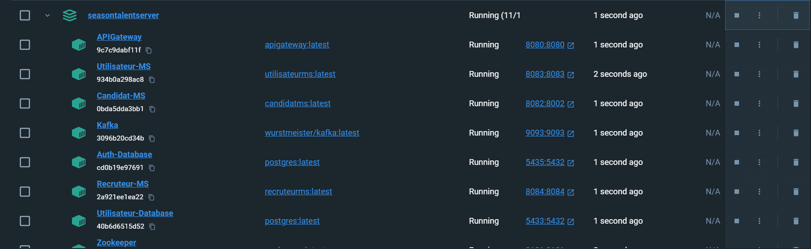

# SeasonTalent
## Serveur REST pour le Recrutement Saisonnier

Le Serveur REST pour le Recrutement Saisonnier est un projet développé en équipe de 3 membres, en parallèle de l'application mobile, sur une période de 2 mois et demi. Ce serveur expose des API RESTful qui permettent aux recruteurs de gérer des offres d'emploi, trouver des candidats, gérer leurs établissements et bien encore.

### Auteurs
- [BELKHIR Salim][Salim_github]
- [FASKA Rachid][Rachid_github]
- [HAKEMI Ayoub][Ayoub_github]

[Salim_github]: https://github.com/Salim-belkhir
[Rachid_github]: https://github.com/playerRC
[Ayoub_github]: https://github.com/ayoubbibo

### Gestion de projet

Pour collaborer à trois sur ce projet, nous avons utilisé directement les projets Github.
Le projet est accessible à partir de ce lien : [Projet IWA sur Github][Project]

[Project]: https://github.com/users/Salim-belkhir/projects/1/views/2

### Technologies Utilisées
- Spring Boot
- PostgreSQL
- Apache Kafka
- Docker (pour les instances de base de données et les microservices)

### Installation
Suivez ces étapes pour configurer et exécuter le serveur localement sur votre ordinateur :

1. Assurez-vous d'avoir Java JDK 8+ installé sur votre système. Vous pouvez le télécharger depuis [le site officiel d'Oracle](https://www.oracle.com/java/technologies/javase-downloads.html) ou utiliser une distribution OpenJDK.

2. Clonez ce dépôt sur votre ordinateur en utilisant la commande suivante :

```bash
git clone https://github.com/votre-utilisateur/votre-projet.git
```

3. Si les sous-dossiers `ApiGateway`, `Candidat`, `EurekaServer`, `Recruteur` et\ou `Utilisateur` sont vides, executez la commande suivante :

```bash
git submodule update --init --recursive
```

4. Accédez au répertoire du projet :
    
```bash
cd SeasonTalentServer
```

5. Créez une fichier `.env` qui contiendra et définira les variable d'environnement suivante (vous pouvez télécharger un exemple [ici](assets/.env)) :

- `GATEWAY_PORT` : Le numéro de port sur lequel tourne la gateway

- `EUREKA_PORT` : Le numéro de port utilisé par le service Eureka pour le discovery

- `SPRING_CANDIDAT_PORT` : Le numéro de port pour le microservice Spring Candidat

- `UTILISATEUR_DB_PORT` : Le numéro de port de la base de données du microservice Utilisateur

- `CANDIDAT_DB_PORT` : Le numéro de port de la base de données du microservice Candidat

- `RECRUTEUR_DB_PORT` : Le numéro de port de la base de données du microservice Recruteur

- `AUTH_DB_PORT` : Le numéro de port de la base de données utilisée par l'API pour l'authentification

- `ZOOKEPER_PORT` : Le numéro de port utilisé par ZooKeeper

- `KAFKA_PORT` : Le numéro de port utilisé par Apache Kafka

- `CANDIDAT_DB_NAME` : Le nom de la base de données du microservice Candidat

- `UTILISATEUR_DB_NAME` : Le nom de la base de données du microservice Utilisateur

- `RECRUTEUR_DB_NAME` : Le nom de la base de données du microservice Recruteur

- `AUTH_DB_NAME` : Le nom de la base de données utilisée par l'Api Gateway pour l'authentification

- `POSTGRES_USER` : Le nom d'utilisateur de la base de données PostgreSQL identique à toutes les bases de données

- `POSTGRES_PASSWORD` : Le mot de passe de l'utilisateur de la base de données PostgreSQL identique à toutes les bases de donnes


6. Lancez `Docker` qui sera nécessaire pour lancer l'application. Une fois que `Docker` est lancé, vous pouvez exécuter la commande suivante pour construire toutes les images, puis les containers et lancer toute l'application en une seule commande :

```bash
docker-compose up --build
```

7. Vérifier que tous les containers sont bien tous lancés. Normalement vous devriez avoir 11 containers qui tournent et s'affichent comme ceci dans **Docker Desktop** :

   